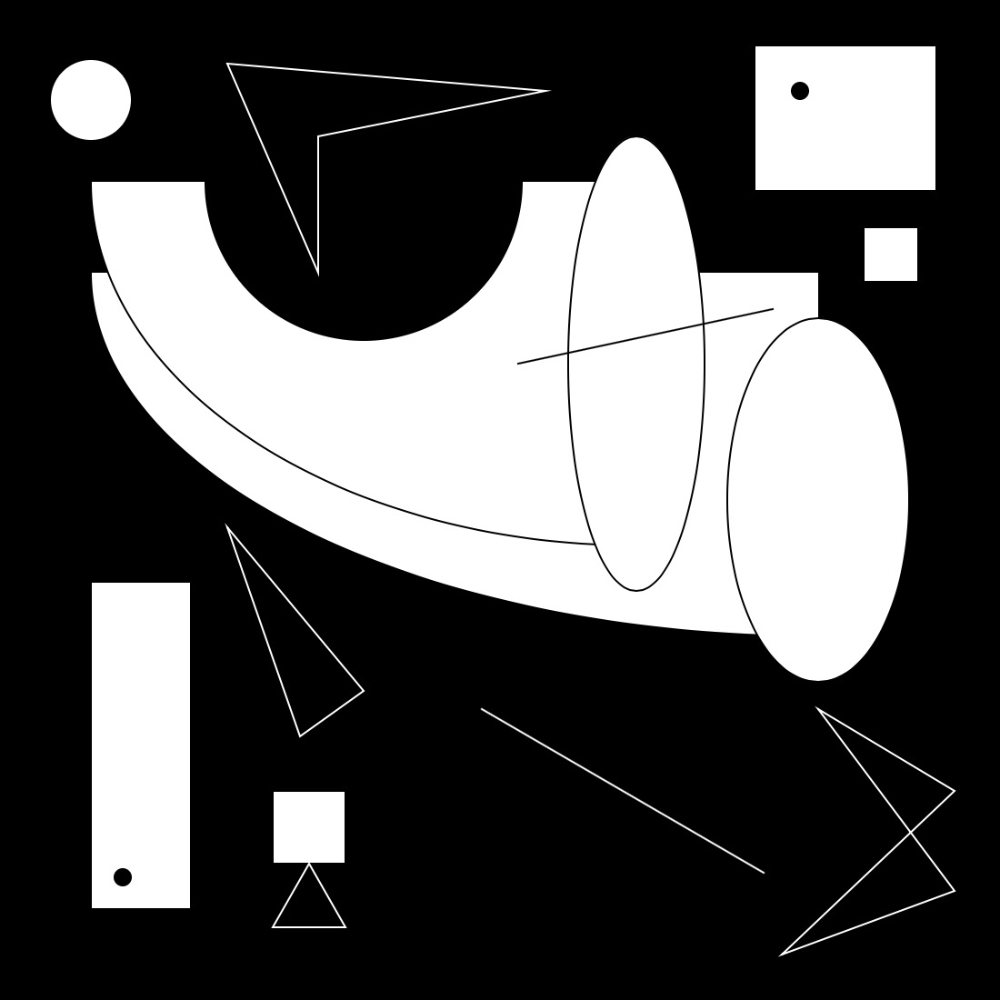
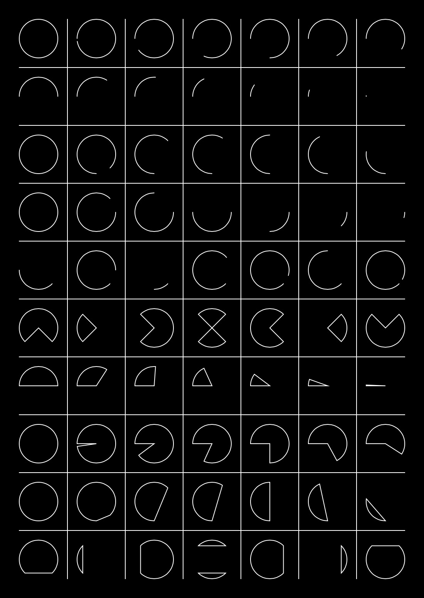

# Coding-Train-p5.js-Course-Progress
Learning p5.js with The Coding Train and documenting my progress/code along the way. I'm a noob so if there are issues with anything I'd appreciate the feedback. 

**1. SHAPES & DRAWING EXERCISE**

Here is my response to the prompt at the end of this intro Coding Train lesson.
* Make your own picture and only use the 2D Primitives
* I added my own constraint - Use only two of each primitive

**2. ALL THE ARCS**

